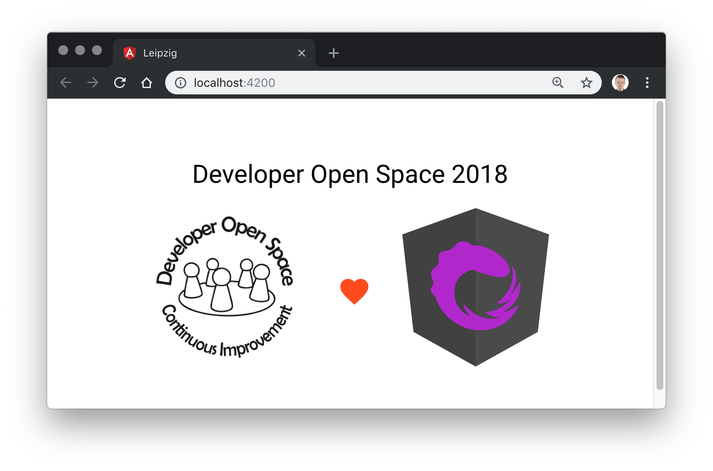

# NgRx Workshop

## Setup

Please `clone` or `fork` this repository to get a local copy of this repository.
Afterwards please install the needed dependencies.

```bash
npm install
```

**Finally** check if everything works starting the application.

```bash
npm start
```

You should be able to see a test page at http://localhost:4200.



🎉 **Congratulations**, you are ready for the workshop. See you!
